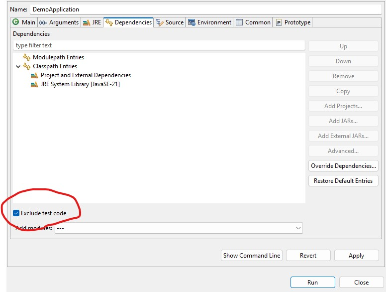

# Demo the eclipse test class path exclusion bug

## How to reproduce

1. Import this project into `Eclipse` as `Gradle` project
2. Create and run the launch configuration for `/eclipse-test-classpath-exclusion-bug/src/main/java/com/example/demo/DemoApplication.java`
3. Find the output on the screen:

```
com.example.demo.DemoApplication         : mytest=testing
```

That is comming from the `integration-test` classpath (`/eclipse-test-classpath-exclusion-bug/src/integration-test/resources/application.properties`) 
and we do not wont it.
For the launch app configuration we want only class path for `main` so this variable should come from the `main` `application.yml` as well any other classes and resources.

4. Go to the app launch configuration and set `Dependencies\Exclude test code` to on.



5. Run the app and see the bug. It can't find the app main class on the classpath:

```
Error: Could not find or load main class com.example.demo.DemoApplication
Caused by: java.lang.ClassNotFoundException: com.example.demo.DemoApplication
```

## Expected behavior

When you set `Dependencies\Exclude test code` on launch configuration it should put only classes from your `main` sourceSet and be able to run the app exactly as if you run it 
from the `bootRun` task.

```
./gradlew bootRun

```

you should see on the output:

```
com.example.demo.DemoApplication         : mytest=main
```


